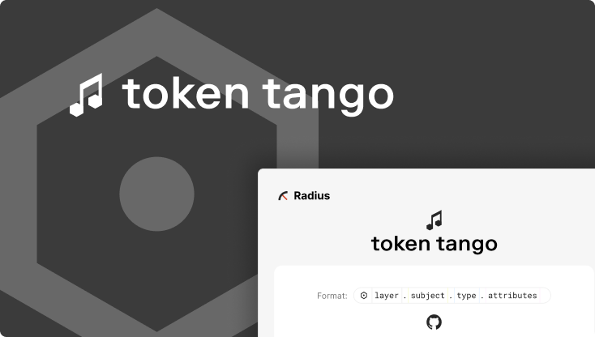

# Radius Token Tango



This repository contains the codebase for the Radius Token Tango project, which includes a Figma Widget and a web UI. The project is structured as a monorepo, containing multiple applications and packages.

## Table of Contents

- [Project Structure](#project-structure)
- [Installation](#installation)
- [Development](#development)
- [Build](#build)
- [Linting and Formatting](#linting-and-formatting)
- [Publishing the Widget](#publishing-the-widget)
- [Future Plans](#future-plans)

## Project Structure

The repository is organized as follows:

- **apps/token-tango-web-ui**: The web UI application for the Token Tango project.
- **apps/token-tango-widget**: The Figma Widget application for the Token Tango project.
- **packages/eslint-config**: Internal ESLint configuration package.
- **packages/typescript-config**: Internal TypeScript configuration package.
- **packages/bandoneon**: Small UI library for the web part of the app.

## Installation

To set up the project, you'll need to have [pnpm](https://pnpm.io/) installed. Once you have `pnpm`, run the following command to install all dependencies:

```sh
pnpm install
```

## Development

To start the development server for all apps, use the following command:

```sh
pnpm dev
```

This will run `turbo dev`, which starts the development server for all applications and packages.

## Build

To build all applications and packages, run:

```sh
pnpm build
```

This will run `turbo build`, which builds all the projects in the monorepo.

## Linting and Formatting

To lint the codebase, run:

```sh
pnpm lint
```

To format the codebase using Prettier, run:

```sh
pnpm format
```

## Publishing the Widget

To publish the Figma Widget, follow these steps:

1. Navigate to the `apps/token-tango-widget` directory.
2. Ensure you have the correct Figma manifest file located at `apps/token-tango.manifest.json`.
3. Follow the steps in [Figma's documentation](https://www.figma.com/widget-docs/) to publish the widget.

## Future Plans

We plan to add more packages in the future, including:

- **Common Logic Library**: A library containing common logic used across the applications.
- **Command-Line Tool**: A tool for converting layer files to other formats.

## License

This project is licensed under the MIT License. See the [LICENSE](LICENSE) file for more details.
